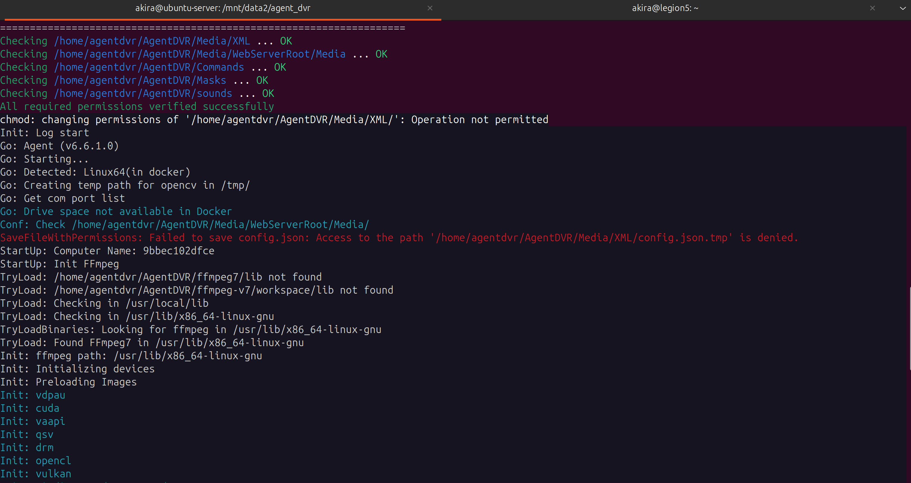
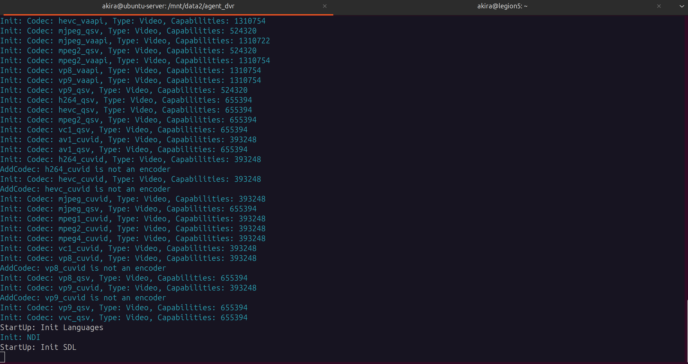
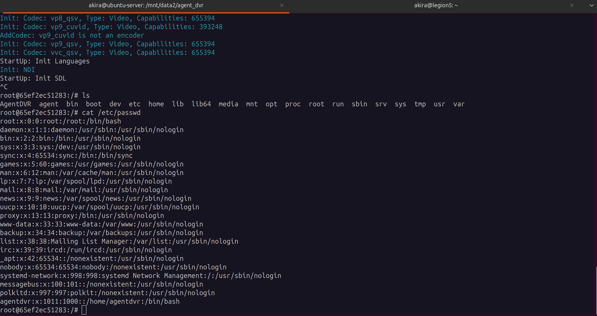
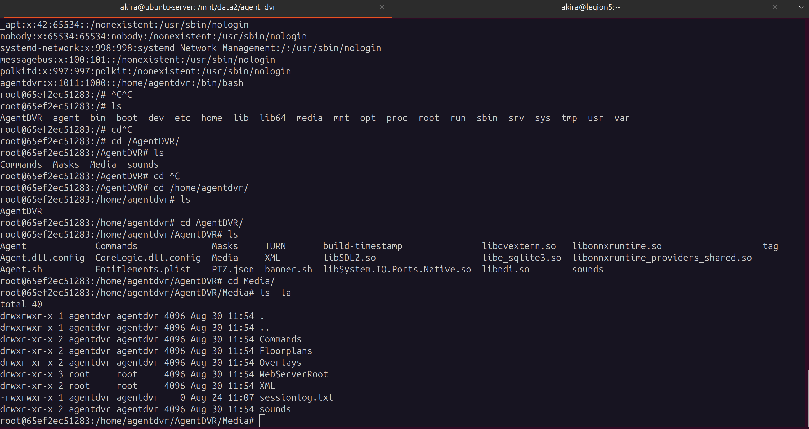
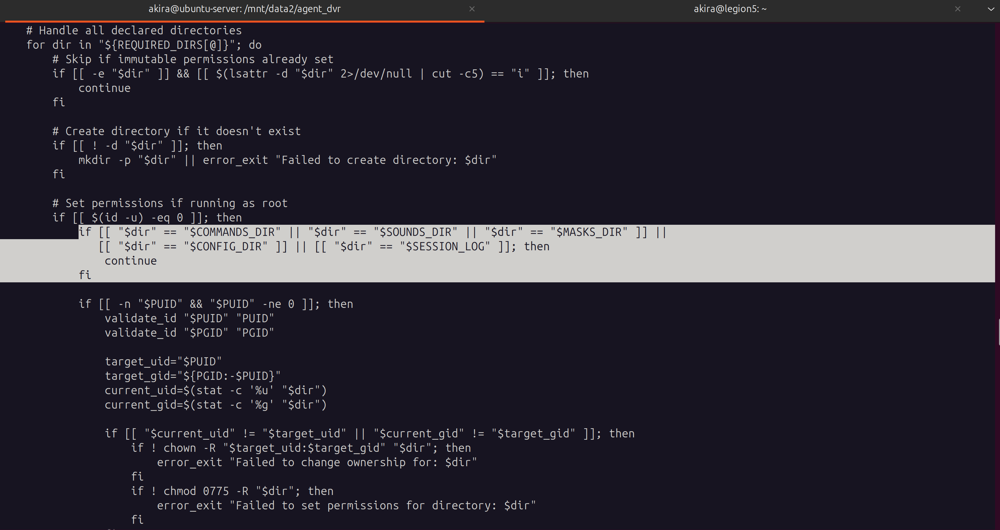
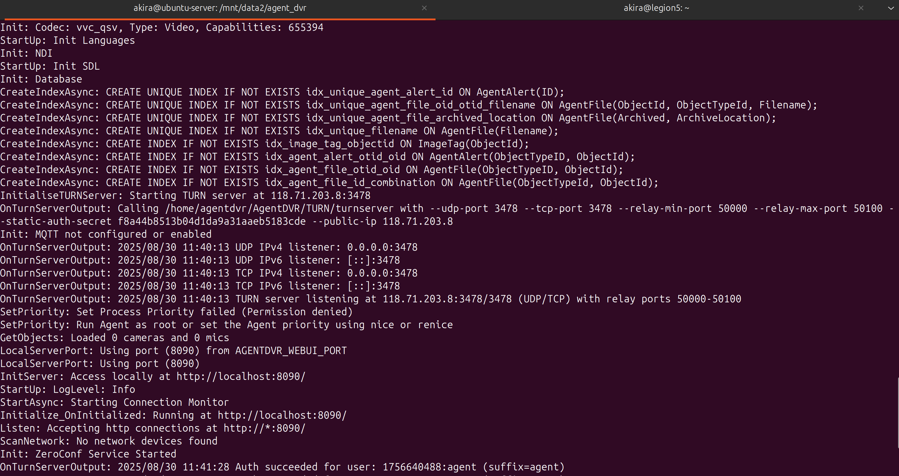

# Troubleshooting Note — Script Works in Terminal but Fails in Cron

**Method:** STAR (Situation • Task • Action • Result)  
**Cron-like simulator:**  
```bash
env -i /bin/bash --noprofile --norc -c '<cmd>'
```

---

## Situation
A shell script runs fine when executed interactively in a terminal but fails or behaves differently when scheduled with `crontab` (or via `/etc/cron.*`).  

Cron executes jobs with a **minimal environment**:
- No interactive shell startup (`.bashrc`, `.profile` not sourced).
- Very limited `PATH`.
- Different working directory (usually `$HOME` or `/`).
- Output is not visible (mailed or discarded).

These differences commonly cause issues such as **“command not found,”** missing environment variables, or failures with relative paths.

---

## Task
Reproduce cron’s runtime environment to observe the failure, identify the root cause, and fix the script so that it works consistently whether run manually or via cron.

---

## Action

### 1. Reproduce cron’s minimal environment
```bash
env -i /bin/bash --noprofile --norc -c '/abs/path/to/script.sh arg1 arg2'
```
- `env -i` → start with an empty environment.  
- `--noprofile --norc` → skip shell init files.  
- Mimics how cron launches jobs.

---

### 2. Capture stdout/stderr like cron would
```bash
env -i /bin/bash --noprofile --norc -c '/abs/path/to/script.sh'   > /tmp/cron_sim.log 2>&1
tail -n +1 /tmp/cron_sim.log
```

---

### 3. Use a cron-like PATH
```bash
env -i PATH="/usr/bin:/bin" /bin/bash --noprofile --norc -c '/abs/path/to/script.sh'
```
---

## Result
- The script now behaves **identically under simulation and cron**.  
- All cron-specific issues (PATH, env vars, working dir, missing shebang) are exposed and logged.  
- Once verified with the simulator, adding the job to `crontab -e` with logging ensures predictable behavior.

---

# Docker AgentDVR Permission Issue (STAR Method)

## **Situation**
While running the official [AgentDVR Docker image](https://hub.docker.com/r/mekayelanik/ispyagentdvr) (`mekayelanik/ispyagentdvr:6.6.1.0`) with custom user and group IDs:

```bash
docker run -it -e PUID=1011 -e PGID=1000 --rm mekayelanik/ispyagentdvr:6.6.1.0@sha256:69b1b4f3256a97558a9bb7f6997b388d2d1e2c62de26635fd478f4640c33f655
```

the container consistently failed at **`StartUp: Init SDL`** with permission errors such as:

```
chmod: changing permissions of '/home/agentdvr/AgentDVR/Media/XML/': Operation not permitted
SaveFileWithPermissions: Failed to save config.json: Access to the path '/home/agentdvr/AgentDVR/Media/XML/config.json.tmp' is denied.
```


The process stuck at init, no error is returned

---

## **Task**
The objectives were to:
1. Verify if `PUID` and `PGID` were applied correctly inside the container.  
2. Identify why directories still triggered permission errors despite correct UID/GID mapping.  
3. Determine whether this was misconfiguration or a bug in the container’s entrypoint logic.  
4. Implement a secure, least-privilege fix that restored normal functionality.

---

## **Action**

### Step 1 – Validate UID/GID mapping
Checked `/etc/passwd` inside the container and confirmed that the `agentdvr` user had the intended UID/GID values.



---

### Step 2 – Inspect directory ownership
Listing `/home/agentdvr/AgentDVR/Media` revealed `XML/` and `WebServerRoot/` were still owned by root.



This explained the “permission denied” errors when writing to `config.json`.

---

### Step 3 – Analyze entrypoint logic
Reviewed `/home/agentdvr/AgentDVR/Agent.sh` and discovered its initialization logic skipped ownership fixes for `XML` and `WebServerRoot`. I don't quite understand why logic but it skip setup correct permissions?

**Conclusion:** Root cause was an **upstream bug in the container script**, not user error.

---

### Step 4 – Apply a secure fix
Overrode the entrypoint to ensure directories were created and re-owned before launching `Agent.sh`:

```bash
docker run --rm -it   -e PUID=1011 -e PGID=1000   --entrypoint bash   mekayelanik/ispyagentdvr:6.6.1.0   -lc '
    set -e
    BASE=/home/agentdvr/AgentDVR/Media
    mkdir -p "$BASE/XML" "$BASE/WebServerRoot" "$BASE/WebServerRoot/Media"
    chown -R 1011:1000 "$BASE/XML" "$BASE/WebServerRoot"
    chmod -R u=rwX,g=rwX,o=rX "$BASE/XML" "$BASE/WebServerRoot"
    exec /home/agentdvr/AgentDVR/Agent.sh
  '
```

**Expected output** – container now passes the SDL init phase and continues to full initialization:


---

### Step 5 – Automate fix with Ansible
Converted the manual fix into an Ansible playbook for reproducibility:

```yaml
- name: Manage Agent DVR
  hosts: ubuntu-server
  become: yes
  vars:
    uid: 1011
    home_dir: /mnt/data2/agent_dvr

  pre_tasks:
    - name: Ensure directory exists
      ansible.builtin.file:
        path: "{{ home_dir }}"
        state: directory
        mode: "750"
        owner: "{{ uid }}"

    - name: Create agent_dvr user
      ansible.builtin.user:
        name: agent_dvr
        uid: "{{ uid }}"
        system: true
        home: "{{ home_dir }}"

  tasks:
    - name: Ensure Agent DVR is running
      ansible.builtin.docker_container:
        entrypoint: bash
        command: >
          -lc "set -e;
          BASE=/home/agentdvr/AgentDVR/Media;
          mkdir -p $BASE/XML $BASE/WebServerRoot $BASE/WebServerRoot/Media;
          chown -R 1011:1000 $BASE/XML $BASE/WebServerRoot;
          chmod -R u=rwX,g=rwX,o=rX $BASE/XML $BASE/WebServerRoot;
          exec /home/agentdvr/AgentDVR/Agent.sh"
        restart_policy: always
        image: mekayelanik/ispyagentdvr:6.6.1.0@sha256:69b1b4f3256a97558a9bb7f6997b388d2d1e2c62de26635fd478f4640c33f655
        name: agent_dvr
        env:
          PUID: "{{ uid }}"
          PGID: "1000"
          AGENTDVR_WEBUI_PORT: "8090"
        volumes:
          - "{{ home_dir }}:/AgentDVR"
        networks:
          - name: runtime-network
            ipv4_address: "192.168.30.5"
```

---

## **Result**
- ✅ Root cause identified: **entrypoint script skipped re-owning `XML` and `WebServerRoot`**.  
- ✅ Fix applied by correcting ownership and permissions before `Agent.sh` execution.  
- ✅ Application now initializes fully, starts the TURN server, and serves the Web UI at `http://localhost:8090`.  
- ✅ Security preserved by avoiding root and enforcing least-privilege.

---

## **Takeaway**
This troubleshooting highlights the importance of:
- Inspecting container internals instead of assuming user error,  
- Tracing failures to entrypoint script logic, and  
- Implementing precise, minimal fixes rather than broad permission workarounds.

In summary, the failure originated from an **upstream bug** in the container’s initialization script—not from misconfiguration.