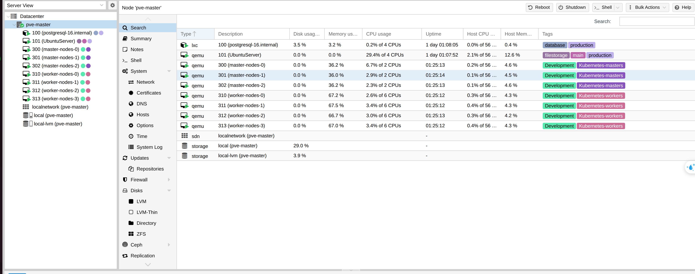
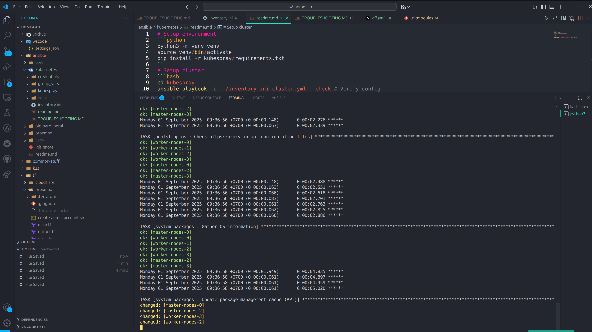
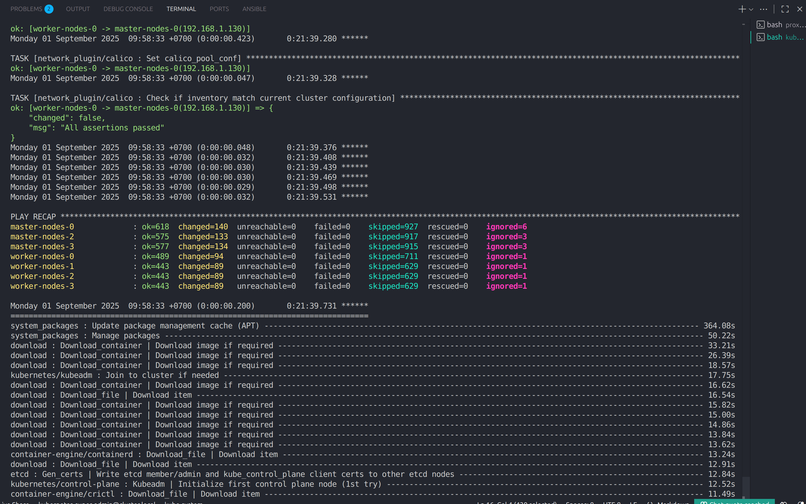
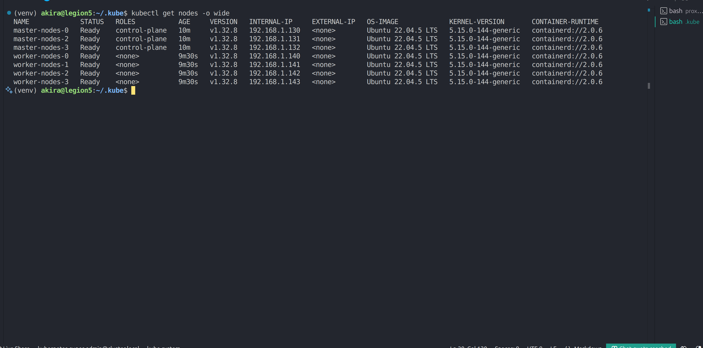

# 🚀 Kubernetes Cluster Deployment with Kubespray [(v.28.0)](https://github.com/kubernetes-sigs/kubespray/tree/v2.28.1)

## 1. Requirements
- Kubernetes infrastructure has already been provisioned using [Terraform](https://github.com/ngodat0103/home-lab/blob/78b9e58daded8fd905d2746e037d1dfddbe6eb6e/tf/proxmox/main.tf#L149-L194).  
  👉 Ensure the VMs are created and reachable via SSH before continuing.  



- Python 3 and Ansible are available on your workstation.  

---

## 2. Setup Environment
Create and activate a Python virtual environment, then install Kubespray dependencies:

```bash
python3 -m venv venv
source venv/bin/activate
pip install -r kubespray/requirements.txt
```

---

## 3. Setup the Cluster

### Step 1: Verify Configuration
Run a dry-run to confirm Ansible can reach the hosts and that variables are valid:

```bash
cd kubespray
ansible-playbook -i ../inventory.ini cluster.yml --check
```



### Step 2: Deploy the Cluster
If verification passes, run the full deployment:

```bash
ansible-playbook -i ../inventory.ini cluster.yml -v
```

- `-v` provides verbose logs.  
- Add `-b` if privilege escalation (become) is required on your hosts.  



---

## 4. Configure kubectl Access

After deployment, copy the generated `super-admin.conf` kubeconfig from one of your master nodes into your local machine.  
⚠️ **Backup your existing kubeconfig** first if you already have one.

```bash
scp -i ~/OneDrive/ssh/k8s/id_rsa \
  root@192.168.1.130:/etc/kubernetes/super-admin.conf \
  ~/.kube/config.yaml
```

---

## 5. Update the API Server Endpoint

By default, the kubeconfig points to the specific master node you copied it from.  
It’s recommended to update it to use the **virtual IP (VIP)** of the control plane for high availability.  

```bash
sed -i 's|server: https://[0-9\.]*:6443|server: https://192.168.1.135:6443|' ~/.kube/config.yaml
```

👉 You can configure the VIP and related settings in `group_vars/all/all.yml`.  

---

## ✅ Next Steps
- Test connectivity:
  ```bash
  kubectl --kubeconfig ~/.kube/config.yaml get nodes
  ```



- Merge this kubeconfig with your default `~/.kube/config` if you want to manage multiple clusters.  